# uulmduino


Ein Free-Hardware+Software-Projekt für den Girls'Day 2015 an der Universität Ulm.  

Basierend auf dem Diavolino von Evil Mad Scientist  
http://www.evilmadscientist.com/go/diavolino

Bausatzversion 2
Handbuch v. 0.21, 2015-11-25

# Was ist was?

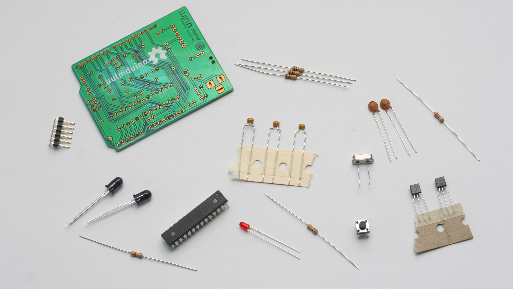

 1. Platine
 2. Kurzanleitung (nicht abgebildet)
 3. 1kΩ-Widerstände,¼ Watt (3 Stück)
 4. 10kΩ-Widerstand, ¼ Watt
 5. 18pF-Kondensatoren (2 Stück) (Schwarzer Streifen!)
 6. 1µF-Kondensatoren (3 Stück)
 7. Mikroschalter
 8. LED
 9. Quarz
 10. Header
 11. Microcontroller
 12. 22Ω-Widerstand, ¼ Watt
 13. 470kΩ-Widerstand, ¼ Watt
 14. Transistoren PN2222A (2 Stück)
 15. Infrarot-LEDs LD271 (2 Stück)
 16. Batteriekasten 3×AAA (nicht abgebildet)
 17. Header für Arduino-kompatible Shields (nicht abgebildet)

# Optional für zuhause

Diese Teile reichen vollkommen, um einen Universal-Fernsehausknipser (TV-B-Gone) für unterwegs zu bauen. Für die Programmierung und weitere Experimente in diesem Handbuch sind weitere Teile nötig, die wir Dir aufgrund der Kosten leider nicht mitgeben können. Du kannst sie dir aber für wenig Geld online kaufen, falls du zuhause weitermachen möchtest!

## Für die Programmierung…

Der uulmduino ist Arduino-kompatibel, benötigt aber eine Programmierschnittstelle.

### Ein USB-TTL-Kabel

…mit dem FTDI-chip TTL-232R oder einem vergleichbaren Modell. Das ist ein „intelligentes“ Adapterkabel mit einer eingebauten USB-Schnittstelle. Eine Seite wird in Deinen USB-Port eingesteckt, die andere in den uulmduino. Das Kabel ermöglicht Dir, den uulmduino mit der Arduino-Entwicklungsumgebung zu programmieren (http://arduino.cc/).
Alternativ kann uulmduino auch mittels eines AVR-ISP-Programmierers programmiert werden, zum Beispiel dem USBtinyISP.

### Computer, Internetzugang, USB-Port…

Alle Software, die Du benötigen wirst, ist kostenlos erhältlich. Du brauchst nur einen nicht allzu antiquierten Rechner (Mac, Windows oder Linux) und einen Internetzugang, um die Arduino-Software herunterzuladen.

# Tipps fürs Löten

Die meisten Probleme mit Lötbausätzen sind auf unzureichende Lötstellen zurückzuführen. Bevor wir fortfahren, gibt es hier einen Mini-Lötkurs, mit unserer empfohlenen Vorgehensweise, um die einzelnen Bauteile in die Platine einzulöten. Sie ist auf die meisten Teile dieses Bausatzes anwendbar.

## Bauteile auf die Platine einlöten

 0. Biege die Anschlussdrähte der Teile zurecht, falls nötig. (Zum Beispiel diese Widerstände).
 1. Setze jedes Bauteil von oben her an der vorgesehenen Stelle in die Platine ein. Drücke es bündig an die Platine an (Beachte, dass einige Teile in eine bestimmte Richtung eingesetzt werden müssen – zum Beispiel der Chip und die LED)
 2. Falls das Bauteil flexible Anschlussdrähte hat, biege die Drähte vorsichtig nach außen, bis zu einem Winkel von etwa 45°. Das hält das Bautel an seinem Platz fest, während Du es festlötest.
 3. Löte von der Rückseite her einen Anschlussdraht nach dem anderen an die Platine an.
  * Die Lötspitze muss glänzend (verzinnt) sein. Falls sie das nicht ist, schmelze ein wenig frisches Lötzinn an der Spitze an und wische sie auf einem feuchten Schwamm sauber.
  * Halte das Lötzinn an die Verbindung, die Du verlöten möchtest.
  * Halte den Lötkolben für etwa eine Sekunde an die Lötstelle und das Lötzinn. Zähle einfach laut mit: „Eintausendeins“.
  * Das Lötzinn sollte an die Lötstelle anschmelzen und eine glänzende, etwas feucht aussehende Lötstelle hinterlassen. Falls nicht, lass' sie abkühlen und versuche es noch einmal.
 4. Falls das Bauteil lange und/oder biegbare Anschlussdrähtchen hat, schneide den auf der Unterseite überstehenden Draht ab – dicht an der Platine, aber nicht so nahe daran, dass Du in die Platine selbst hineinschneidest.

 1. Einsetzen!
 2. Biegen!
 3. Löten!
 4. Kürzen!

## Wir fangen mit den 1kΩ-Widerständen an (#3)

Alle Widerstände sind mit Farbringchen codiert. Die 1kΩ-Widerstände, die wir jetzt brauchen, haben der Reihe nach die Farbe Braun-Schwarz-Rot (und danach ein goldenes Ringchen). Schau genau hin und verwechsle sie nicht mit dem 10kΩ-Widerstand – der hat ein orangenes statt eines roten Ringchens!

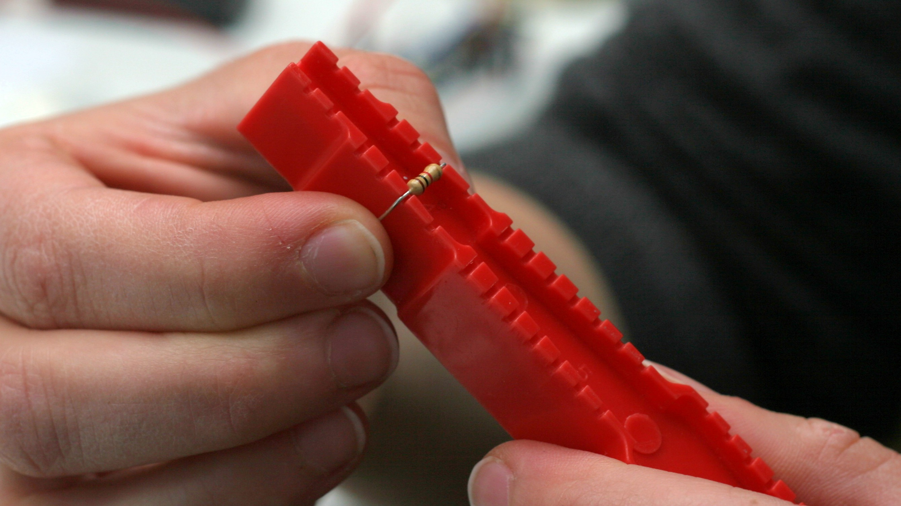

Stecke den Widerstand an die mit **R2**, **R3** und **R5** markierten Stellen in die Anschlusslöcher. Wie herum du ihn einsetzt, ist egal – ein Widerstand funktioniert in beide Richtungen.

Plan auf die Platine aufdrücken…


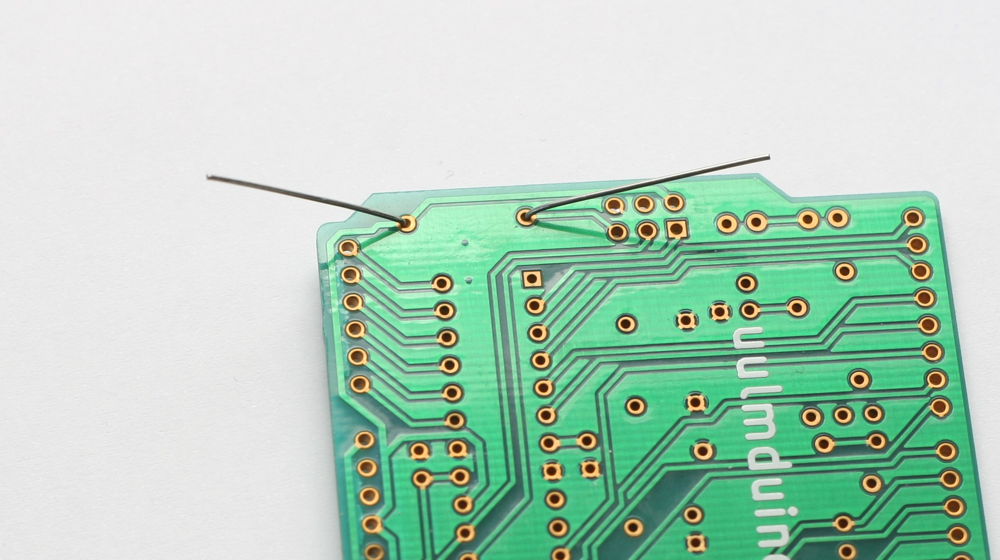

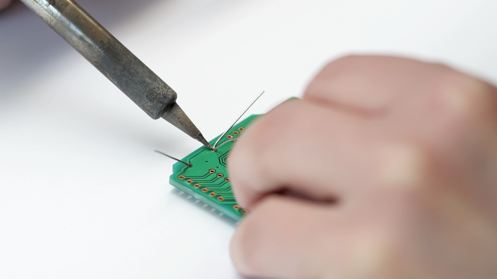

Überprüfe die Lötstellen. Sie sollten glänzend aussehen, und das Lötpad (auf der Platine) und die Beinchen ganz umfließen.

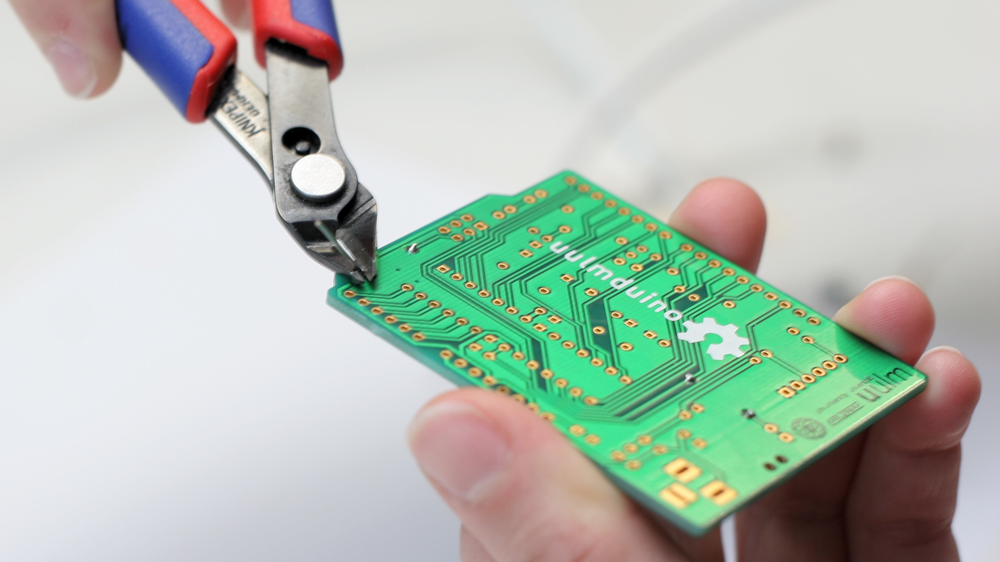

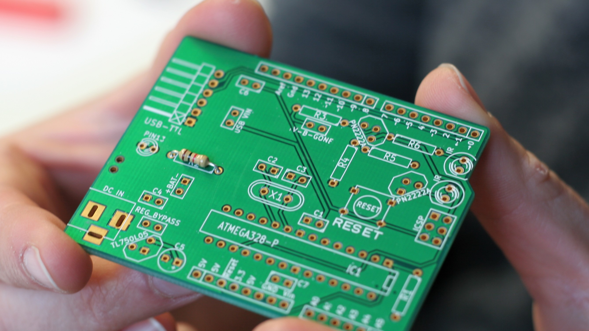

## Als nächstes: Der 10kΩ-Widerstand, #4.

Das ist nun der Widerstand mit Braun-Schwarz-Orangen Ringchen. Verlöte diesen Widerstand auf dieselbe Weise an der Stelle, an der **R1** auf der Platine steht.

## 18pF-Kondensatoren, #5.

Die zwei 18pF-Kondensatoren im Bausatz sind mit einem schwarzen Strich versehen.


Biege die Anschlussdrähte auf der Platinenunterseite auseinander, löte sie dann fest und kürze die Enden.

## 0,1µF-Kondensatoren, #6.

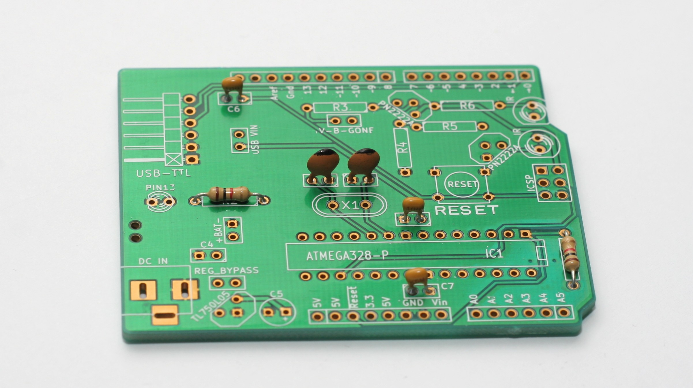

Löte die drei Kondensatoren an diesen Stellen fest. Biege, verlöte und kürze die Anschlussdrähte wie zuvor beschrieben!

## Mikroschalter, #7.

Stecke den Schalter an dieser Stelle in die Platine.
Unter Umständen *schnappt* er richtiggehend ein.

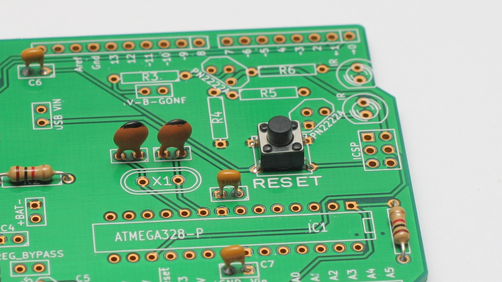

Du kannst die Anschlusspins nach innen biegen, damit der Schalter beim Löten nicht herausfällt. Die Anschlusspins sind kurz und müssen normalerweise nach dem Löten nicht gekürzt werden.

## LED, #8.

3mm diffus-rote LED. Beachte die unterschiedlich langen Anschlussbeinchen: Richtig einsetzen ist wichtig!

Stecke das *kurze Ende* durch das *quadratische Loch* an der Stelle **LED3/PIN13**. Das *kurze Ende* sollte auf der Seite der Zeichnung auf der Platine sein, an der der Kreis abgeflacht ist.

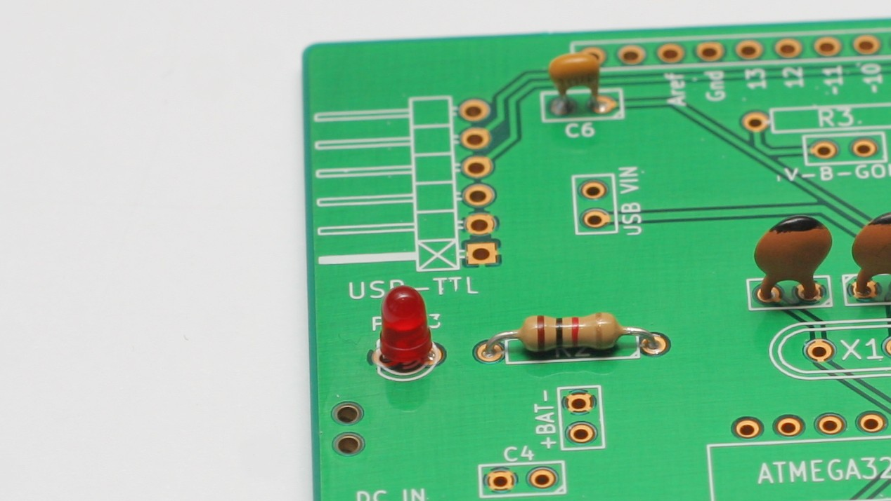

## 16-MHz-Quarzkristall, #9.

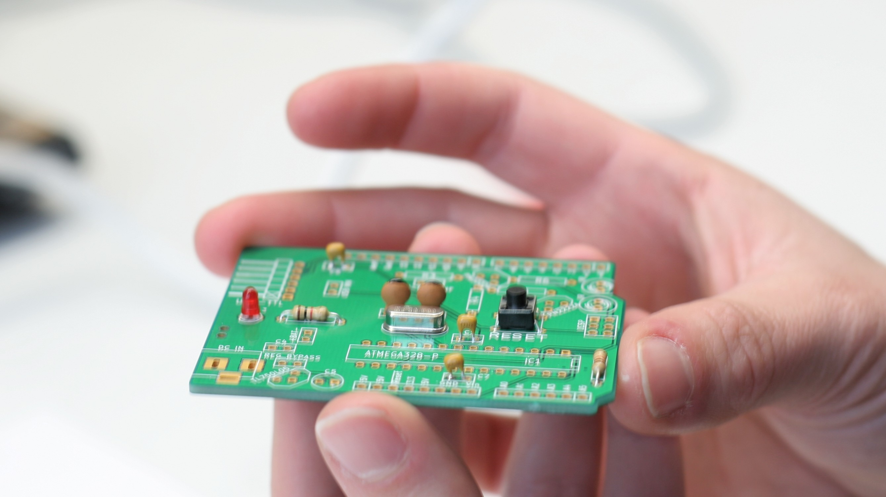

Wie herum Du es einsetzt, ist egal.

Dann wieder wie gewohnt plandrücken, löten und kürzen.

## TTL-Programmieranschluss #10.

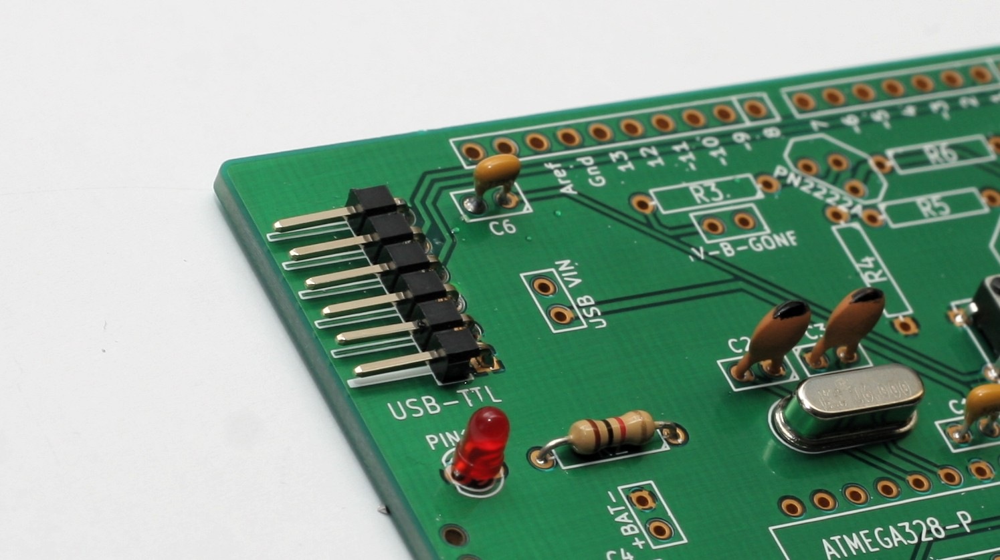

Setze den abgewinkelten TTL-Programmieranschluss (mit den sechs Pins) in die Platine ein, damit Du siehst, wie er hineingehört.

Die Anschlussbeinchen lassen sich nicht verbiegen. Löte daher eines der Beinchen von oben her an, um es fürs Verlöten zu fixieren.

Löte die anderen Beinchen von der Rückseite her fest. Die Beinchen müssen nach dem Verlöten nicht gekürzt werden.

## Jetzt kommt der Fernseh-Ausknips-Part

Die Widerstände R3 und R5, die zum Infrarotsender gehören, hattest Du ja schon eingelötet. Zwei fehlen aber noch.

### Widerstand 22Ω

Auch diesen Widerstand findest Du über seine Farbmarkierung. Er hat Rot-Rot-Schwarze Ringchen (und wieder ein goldenes am Ende). Er kommt an die Stelle **R6**

### Widerstand 470kΩ

Und das ist der letzte der Widerstände. Er ist Gelb-Lila-Gelb markiert und kommt an die Position **R4**.

### Die Transistoren

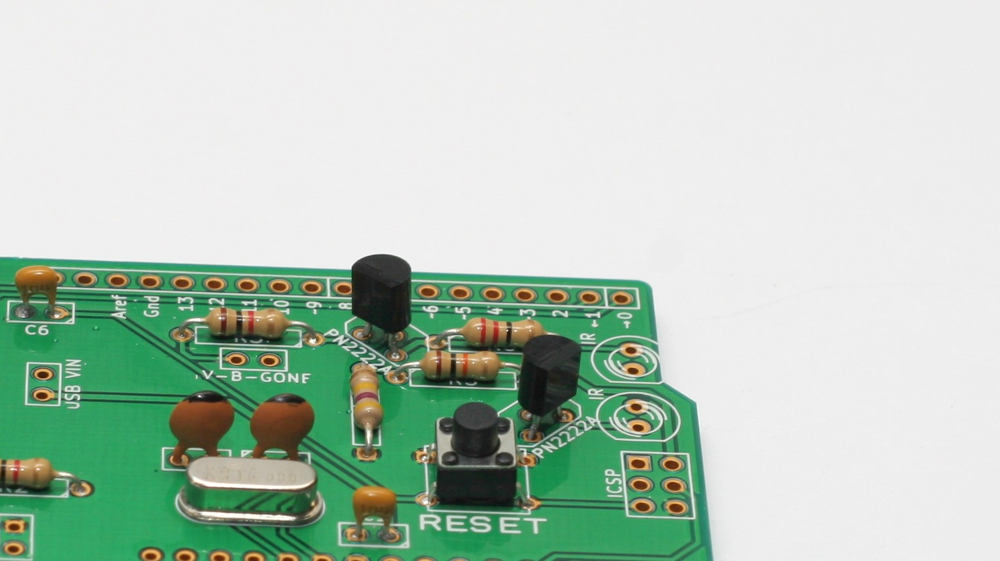

Die Transistoren sorgen dafür, dass aus dem schwachen Signal aus dem Microcontroller richtig viel Power wird – damit der Ausknipser auch auf weitere Entfernungen funktioniert!
Schau Dir das Gehäuse gut an: Es ist auf einer Seite bauchig, und auf der anderen Seite abgeflacht.
Auf der Platine findest du eine ähnliche Markierung, mit der Bezeichnung **PN2222A**.

Lasse ein paar Millimeter Abstand zur Platine (das geht fast schon automatisch, wegen der herausgebogenen Beinchen), biege die Beinchen unten wie gewohnt auseinander, biege sie um, löte sie fest und knipse sie ab!

### Infrarot-LEDs

Diese LEDs leuchten für uns Menschen unsichtbar, aber ein Fernseher kann dieses Infrarotlicht empfangen. Auch wenn wir das Licht aus den LEDs nicht sehen können, ist es ganz schön hell – Du solltest deshalb nicht in sie hineinsehen, während dein uulmduino Fernseher auszuschalten versucht.

Sie kommen an die Stelle, die mit **IR** bezeichnet ist. Das kürzere der Beinchen kommt wieder in das Loch auf der Seite, an der der Kreis auf der Platine abgeflacht ist. Das Gehäuse der LED ist an dieser Stelle ebenfalls abgeflacht – das hilft Dir bei der Orientierung!

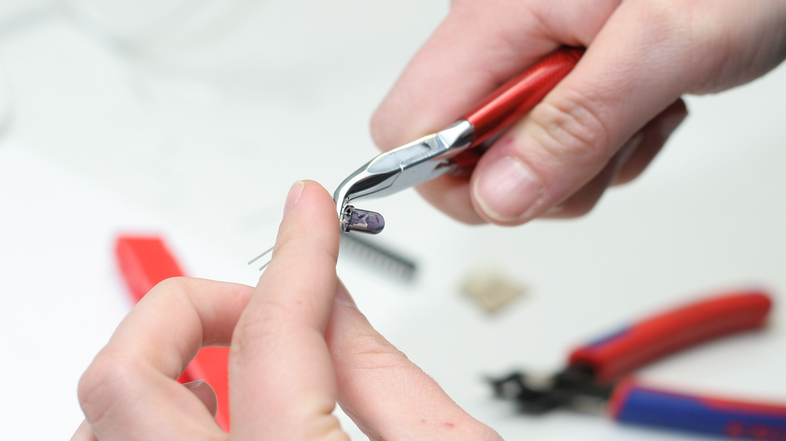

### Damit Du den uulmduino flexibel benutzen kannst: Eine Steckbrücke

An die mit **TV-B-GONE** beschriftete Stelle kommt wahlweise eine Steckbrücke oder eine Drahtbrücke. Wenn du weißt, dass Du den uulmduino *immer* nur als Fernsehausknipser verwenden möchtest, kannst Du hier auch direkt einen Draht einlöten.

Falls Du zuhause auch noch ein wenig mit der Arduino-Funktionalität des uulmduino experimentieren magst, kannst Du stattdessen eine Steckbrücke einlöten. So kannst Du immer dann einen Jumper auf die Steckbrücke aufsetzen, wenn Du Fernseher ausknipsen magst – und falls Du den Pin 9 (auf dem der Infrarotsender angeschlossen ist) für etwas anderes benutzen magst, kannst du den Jumper wieder abnehmen.

*Wichtig:* Wenn Du eigene Programme mit dem uulmduino verwendest, solltest Du Pin 9 nicht anschalten, solange der Infrarotsender mit Pin 9 verbunden ist. Die Infrarotschaltung ist auf die typischen kurzen Pulse einer Fernbedienung ausgelegt – und so kann sie auch minuten- oder stundenlang betrieben werden. Wenn Du sie jedoch *dauerhaft* anschaltest, können die LEDs irgendwann durchbrennen.

## Zeit für den Microcontroller.

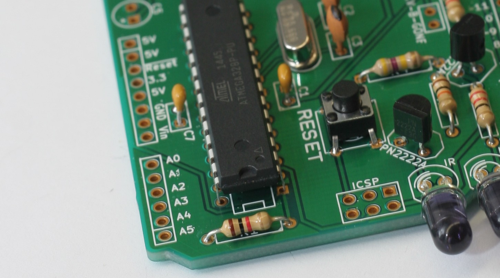

### Setze den Chip vorsichtig ein.

Überprüfe zur Sicherheit nochmal, ob Du ihn richtigherum eingesetzt hast.

Der Chip sollte sich mühelos durch die Löcher stecken lassen. Falls nötig, biege die Beinchen des Chips vorsichtig so, dass sie gerade nach unten zeigen. Biege sie nicht einzeln von Hand, sondern biege alle Beinchen einer Seite gleichzeitig zurecht, indem du den Chip seitlich auf eine harte, ebene Unterlage drückst.

Drehe die Platine um und löte den Chip fest – an allen 28 Beinchen. 

*Tip:* Du kannst die Beinchen an den Ecken vorsichtig umbiegen, damit der Chip festsitzt, während Du ihn festlötest.

## Damit ist die Platine eigentlich schon fast fertig!

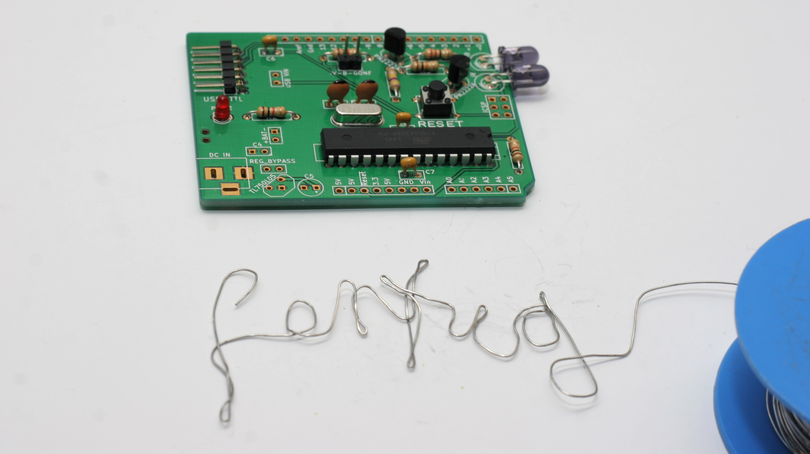

Wir brauchen aber noch eine Spannungsquelle, damit Du den uulmduino auch betreiben kannst.

Der Chip benötigt 4,5–5,5 V Gleichstrom, wenn er mit 16 MHz läuft. Du kannst ihn mittels dreier AA- oder AAA-Alkaline-Batterien mit 4,5V versorgen.

*Anmerkung:* Akkus reichen in der Regel nicht aus, um die erforderliche Spannung zu liefern.

Der Diavolino passt wunderbar auf einen Batteriekasten.

Um das Ganze noch praktischer zu machen, kannst du die Anschlussdrähte auf einige Zentimeter kürzen (und die Enden abisolieren), um weniger Kabelsalat zu haben.

Du kannst ihn auch mit einem Stück doppelseitigem Schaumstoffklebeband direkt auf den Kasten aufkleben.

Egal ob du die Leitungen nun kürzt oder nicht, so werden sie festgemacht: Du lötest den roten Draht in das Loch mit **+** und den schwarzen Draht in das mit **–** markierte Loch.

## Zuletzt: Verbindungsheader hinzufügen

Diese Header sind optionale Extras, wenn Du Arduino-kompatible „Shield“-Platinen auf den Diavolino aufzustecken möchtest. Stecke sie wie hier gezeigt durch die Löcher und löte sie plan auf der Platine fest.

Zwei Header mit 6 Beinchen, zwei mit 8 Beinchen.

Anmerkungen:
 1. Die Beinchen können nicht wirklich gut verbogen werden, um die Header an Ort und Stelle zu halten. Es ist einfacher, sie mit Kreppband zu fixieren – oder die gesamte Platine umzudrehen, so dass sie auf den Headern liegt.
 2. Am besten lötest du zuerst nur jeweils ein Beinchen fest, damit Du prüfen kannst, ob die Header plan und gerade sitzen, bevor Du sie endgültig verlötest.
 3. Die Beinchen sind kurz genug, so dass Du sie in der Regel nicht kürzen musst.


# Experimentieren!

In diesem Kapitel haben wir einige Experimente zusammengestellt, die wir dem freien Sparkfun Inventors' Kit (SIK) entnommen haben. Du brauchst dafür nur ein Steckbrett („Breadboard“), einige Verbindungskabel („Jumperkabel“) und elektronische Kleinteile. Wir können Dir die zwar leider nicht mit nach Hause geben, Du kannst sie aber für wenig Geld nachkaufen – entweder im Elektronikladen, oder in diversen Onlineshops oder im Onlineversteigerungshaus. Wenn die Teile aus Fernost kommen, sind sie meistens viel billiger, brauchen aber sehr lange für den Versand.

Das SIK findest Du online auf https://www.sparkfun.com/products/12060 – dort findest Du auch das komplette SIK-Handbuch und den dazugehörigen Code mit allen möglichen Experimenten, die Du mit dem uulmduino, Breadboard und einigen Kleinteilen selber durchführen kannst!

## Das USB-TTL-Kabel anschließen

Auf der Platine steht ein „USB-TTL“ – an diese Seite kommt die mit „GND“ beschriftete Seite deines Kabels. Falls Du ein Kabel mit Farbcodierung hast: Schwarz kommt nach unten (in Richtung der „USB-TTL“-Beschriftung), Grün nach oben.

Stecke die andere Seite des Kabels in den USB-Port Deines Computers. Die meisten Betriebssysteme (vor allem die meisten GNU/Linux- und Mac-Betriebssysteme) unterstützen das FTDI232-Kabel von Haus aus. Bei anderen Betriebssystemen musst Du gegebenenfalls noch einen Treiber installieren. Auf www.sparkfun.com/FTDI findest Du eine Anleitung hierfür.

## Öffne die Arduino IDE

Öffne die freie Arduino-IDE-Software auf Deinem Computer, die Du von arduino.cc heruntergeladen hast. Spiele ein wenig herum und mache Dich mit der Benutzeroberfläche vertraut. Wir fangen jetzt noch nicht direkt mit der Programmierung an, das ist nur eine Einführung. In diesem Schritt stellen wir die IDE so ein, dass sie Deinen uulmduino erkennt.

## Wähle Dein Board aus: Arduino Uno

Dein uulmduino und der Arduino UNO sind baugleich, aber Du findest den uulmduino nicht in der Arduino-Software. Wähle stattdessen „Arduino UNO“ aus.

## Wähle Deine serielle Schnittstelle

Wähle die serielle Schnittstelle, an der der uulmduino angeschlossen ist, aus dem *Tools | Serial Port*-Menü aus. Um die passende Schnittstelle herauszufinden, kannst Du das USB-TTL-Kabel ausstecken und das Menü nochmals öffnen – der Eintrag, der nun verschwunden ist, sollte der uulmduino sein. Verbinde das Board wieder und wähle diese Schnittstelle aus.

Auf dem Mac sollte diese */dev/tty.usbmodem* oder */dev/tty.usbserial* im Namen haben. Unter Windows dürfte das in der Regel COM3 oder höher sein. Beim Girls'Day haben wir Dir bereits alles voreingestellt.

## Lade den Arduino-Code herunter (den wir für die Schaltkreise dieses Handbuchs verwenden)

Für den Girls'Day haben wir Dir bereits alles auf unseren Rechnern eingerichtet.

Falls Du zuhause weiter experimentieren magst, kannst Du die Originalcodes des SIK verwenden – die es aber leider nur auf Englisch gibt. Im SIK-Handbuch auf https://www.sparkfun.com/products/12060 findest Du den Link und eine Anleitung dafür.


## Erste Schritte mit Schaltkreisen


### Was ist ein elektrischer Schaltkreis?

Ein Schaltkreis ist ein elektrischer Kreis mit einem Start- und einem Endpunkt – mit einer beliebigen Anzahl von Bauteilen dazwischen. In einem Schaltkreis können Widerstände, Dioden, Spulen, Sensoren in allen Größen und Formen, Motoren und beliebige andere aus hunderttausenden weiteren Bauteilen vorkommen.

Man unterscheidet üblicherweise drei Arten von Schaltkreisen: Analoge, digitale und hybride Schaltkreise. In diesem Handbuch wirst Du alle drei Arten kennenlernen und ausprobieren.

### Die Welt läuft mit Schaltkreisen:

Egal wohin Du siehst, wirst Du Schaltkreise finden. Das Handy in Deiner Tasche; der Computer, der die Abgasregelung Deines Autos steuert, deine Videospielkonsole – all diese Geräte sind bis zum Rand voller Schaltkreise. In diesem Handbuch wirst Du mit einigen einfachen Schaltungen experimentieren und die Kurzfassung der Welt der eingebetteten Elektronik kennenlernen.


### Einfache und komplexe Schaltungen

Mit diesem Handbuch wirst Du hauptsächlich einfache Schaltungen erforschen – das bedeutet jedoch nicht, dass Du mit diesen einfachen Werkzeugen keine beeindruckenden Dinge anstellen könntest! Wenn Du das SIK durchforscht hast, wirst Du genügend viel über elektronische Schaltungen wissen, um selbständig tolle Projekte zu entwickeln und die Kraft deiner Phantasie zu entfesseln.


## Schaltung 1: Eine LED zum Blinken bringen

Wir verwenden die LED auf dem uulmduino, die mit einem Vorwiderstand (R2 rechts daneben, Du hast ihn selber eingelötet! :D) mit Pin 13 verbunden ist.

### Öffne Deinen ersten Sketch

„Sketch“ heißen die Programme in der Arduino IDE. Wir haben bereits Code vorbereitet, der die LED zum blinken bringt. Du musst ihn nicht abschreiben, sondern Du findest ihn im Sketchbook unter „uulmduino“!

```
/*
  Blinken
  Schaltet eine LED eine Sekunde lang an,
  und dann wieder eine Sekunde lang aus.
  Dieser Beispielcode ist gemeinfrei (public domain).
*/

void setup() {
  // Initialisiere den Digital-Pin als Ausgang
  // Auf den meisten Arduinos ist Pin 13 mit einer LED verbunden
  pinMode(13, OUTPUT);
}

void loop() {
  digitalWrite(13, HIGH); // schalte die LED an
  delay(1000);            // warte eine Sekunde lang
  digitalWrite(13, LOW);  // schalte die LED aus
  delay(1000);            // warte eine Sekunde lang
}
```

Mit einem Klick auf **Prüfen** (der runde Button mit dem Häkchen) kannst du überprüfen, ob Dein Code irgendwelche Fehler hat. Mit **Hochladen** (der Button daneben mit dem Pfeil) lädst Du den Sketch auf Deinen uulmduino.

Spiele mit den Einstellungen: Was passiert, wenn Du die Zahlen hinter `delay` änderst? Kannst Du Muster blinken lassen?

### Wie funktioniert das?

#### pinMode(13, OUTPUT);

Bevor Du irgendeinen der uulmduino-Pins benutzen kannst, musst Du dem uulmduino sagen, ob der Pin ein Eingang (INPUT) oder Ausgang (OUTPUT) ist. Um das zu tun, benutzen wir eine eingebaute Funktion namens pinMode().

#### digitalWrite(13, HIGH);

Wenn Du einen Pin als OUTPUT verwendest, kannst Du ihn auf HIGH setzen („anschalten“, d.h. er gibt 5 Volt aus) und auf LOW („abschalten“, d.h. er gibt 0 Volt aus).

## Was Du sehen solltest:

Du solltest Deine LED nun an- und ausgehen sehen. Falls nicht: Prüfe, ob Du die Schaltung richtig aufgebaut hast.

### Anwendung im echten Leben:

Quasi alle modernen Flachbildfernseher und Monitore haben LEDs, die anzeigen, ob das Gerät an- oder ausgeschaltet ist – oder blinken!


## Schaltung 2: Ein Potentiometer

In dieser Schaltung wirst Du mit einem Potentiometer arbeiten. Potentiometer nennt man auch veränderbare Widerstände. Wenn man es an den äußeren Anschlüssen mit 5 Volt und Masse verbindet, liegt am mittleren Pin eine Spannung zwischen 0 und 5 Volt an – je nachdem, wie das Potentiometer gerade durch Drehen eingestellt ist. Ein Potentiometer ist ein perfektes Beispiel eines veränderbaren Spannungsteilers. Die Spannung teilt sich proportional zum Widerstand zwischen dem mittleren Pin und dem Massepin. Mit dieser Schaltung lernst Du, wie Du mit einem Potentiometer die Helligkeit einer LED regeln kannst.


### Teile:

 * Potentiometer (1×)
 * LED (auf dem uulmduino)
 * Drahtbrücken (5×)


### Digital versus Analog:


Wenn Du Deinen uulmduino genauer ansiehst, wird Dir auffallen, dass einige Pins mit „A“ beschriftet sind, und andere einfach nur mit Ziffern. Was ist der Unterschied?

Viele der Geräte, die Du an das Board anschließt – zum Beispiel LEDs und Taster – haben nur zwei mögliche Zustände: An und aus. Man nennt diese Zustände auch „HIGH“ (5 Volt) und „LOW“ (0 Volt). Die Digital-Pins (die nur mit Ziffern) auf dem uulmduino können solche Signale ganz hervorragend entgegennehmen und ausgeben, und können sogar besondere Funktionen übernehmen. Zum Beispiel können sie so tun, als würden sie einen Ausgang dimmen (in dem sie den Ausgang ganz schnell blinken lassen), oder Daten seriell übertragen (indem sie die Daten als Reihe von HIGH- und LOW-Signalen ausgeben).

Es gibt aber eine ganze Menge von Dingen in der Welt, die nicht einfach nur „an“ oder „aus“ sein können. Temperaturen, Kontrollregler usw. haben alle einen durchgehenden Wertebereich zwischen HIGH und LOW. Für solche Situationen hat der uulmduino sechs analoge Eingänge, die eine Eingangsspannung in einen Wert zwischen 0 (0 Volt) und 1023 (5 Volt) übersetzen. Die Analog-Pins sind hervorragend geeignet, um diese Werte aus der „echten Welt“ zu messen und erlauben Dir, an den uulmduino alle möglichen Dinge anzuschließen.

### Codeschnipsel:

#### int sensorValue;

Eine „Variable“ ist ein gespeicherter Wert, dem Du einen Namen gegeben hast. Du musst diese Variable erst einmal einführen (oder „deklarieren“), bevor Du sie benutzen kannst. Hier deklarieren wir eine Variable namens `sensorWert`, vom Typ `int` (Integer, also Ganzzahl). Achte darauf, dass die Groß- und Kleinschreibung der Variablen wichtig ist! Wir benutzen die `analogRead()`-Funktion, um den Wert an einem analogen Eingang einzulesen. `analogRead()` benötigt einen Parameter, den analogen Pin, den Du einlesen möchtest (`sensorPin`), und gibt einen Wert zurück (`sensorWert`), der zwischen 0 (für 0 Volt) und 1023 (für 5 Volt) liegt.

`sensorWert = analogRead(sensorPin);`


#### delay(sensorWert);

Der Arduino ist sehr, sehr schnell – er kann tausende Zeilen Code pro Sekunde verarbeiten. Um ihn ein wenig auszubremsen, damit wir überhaupt sehen können, was er tut, fügen wir häufig kleine Pausen in den Code ein. `delay()` zählt in Millisekunden; eine Sekunde besteht aus 1000 Millisekunden.

### Was Du sehen solltest:

Du solltest die LED schneller oder langsamer blinken sehen, je nachdem, wie das Potentiometer eingestellt ist. Falls das nicht funktioniert: Prüfe, ob Du den Schaltkreis richtig aufgebaut und den Code richtig geprüft und hochgeladen hast – oder schau Dir die Fehlersuche-Tipps unten an.

### Fehlersuche:

#### Mal funktioniert's, mal nicht
Das liegt höchstwahrscheinlich an einem Wackelkontakt an einem der Potentiometer-Pins. Normalerweise reicht hier, das Potentiometer richtig auf das Steckbrett zu drücken und zu halten.

#### Gar nichts funktioniert
Stelle sicher, dass Du nicht aus Versehen den mittleren Pin des Potentiometers an den **digitalen** Pin 0 anstelle des analogen Pin A0 angeschlossen hast.

### Anwendung in der echten Welt:

Die meisten Lautstärkeregler verwenden ein Potentiometer.

## Schaltung 3: Eine RGB-LED

Was ist noch spannender, als eine LED zum Blinken zu bekommen? Verschiedene Farben mit nur einer LED. RGB-LEDs (Rot-Grün-Blau) haben drei Leuchtdioden unterschiedlicher Farben im selben Gehäuse, die zusammen alle möglichen Farben erzeugen können. In diesem Schaltkreis lernst Du, wie Du mit einer RGB-LED viele Farbkombinationen erzeugen kannst. Je nachdem, wie hell die einzelnen Farben jeweils leuchten, kannst du beinahe alle denkbaren Farben erzeugen!


### Teile:

 * RGB-LED (1×)
 * 330Ω-Widerstand (3×)
 * Drahtbrücken (6×)

### Die ganze Wahrheit hinter analogWrite():

Wir haben schon gesehen, dass der Arduino analoge Spannungen (Spannungen zwischen 0 und 5 Volt) mit der analogRead()-Funktion einlesen kann. Gibt es auch eine Möglichkeit, mit dem uulmduino analoge Spannungen auszugeben?

Die Antwort ist nein… und ja. Der uulmduino hat keinen richtigen analogen Spannungsausgan. Aber weil er so schnell ist, kann er ein wenig schummeln, indem er sogenannte PWM benutzt („Pulsweitenmodulation“). Die Pins auf dem uulmduino, neben denen ein „~“ steht, können PWM/Analog-Ausgabe.

Der uulmduino ist so schnell, dass er einen Pin beinahe 1000 Mal pro Sekunde an- und ausschalten kann. PWM geht noch einen Schritt weiter, indem die jeweiligen Anteile der an- und ausgeschalteten Zeit gegeneinander verschoben werden. Wenn der Pin die meiste Zeit auf HIGH geschaltet ist, wirkt eine an den Pin angeschlossene LED sehr hell. Wenn der Pin die meiste Zeit auf LOW geschaltet ist, sieht die LED eher dunkel aus. Weil der Pin deutlich schneller blinkt als Dein Auge erkennen kann, erzeugt der uulmduino die Illusion eines „echten“ analogen Ausgangs.

### Codeschnipsel

> for (x = 0; x < 768; x++) 
> {}

Hier wird eine for()-Schleife benutzt, um einen bestimmten Zahlenbereich durchzuzählen, und jedes Mal wird dann der Code innerhalb der geschweiften Klammern ausgeführt. Hier fängt die Variable "x" bei 0 zu zählen an, hört bei 767 auf, und wird jedes Mal um eins weitergezählt ("x++")

> if (x <= 255)
> {}
> else
> {}

„If-Else“-Ausdrücke („Wenn…sonst“) werden benutzt, um in Deinem Code Entscheidungen zu treffen. Der Ausdruck innerhalb der runden Klammern () wird geprüft; falls er zutrifft (“true”, also „wahr“), wird der Code innerhalb der ersten geschweiften Klammern ausgeführt. Falls er nicht zutrifft, wird der Code innerhalb der zweiten geschweiften Klammern (nach dem “else”) ausgeführt.

> delay(sensorValue); 

Der uulmduino ist sehr sehr schnell – er kann tausende Codezeilen pro Sekunde ausführen. Um ihn ein wenig auszubremsen, damit wir überhaupt sehen können, was er tut, fügen wir häufig kleine Pausen in den Code ein. delay() zählt in Millisekunden; eine Sekunde besteht aus 1000 Millisekunden.
there are 1000 ms in one second.


### Was Du sehen solltest

Du solltest deine LED wieder leuchten sehen, aber dieses Mal in neuen, verrückten Farben! Falls sie das nicht tut, stelle sicher, dass Du den Schaltkreis richtig aufgebaut und den Code geprüft und hochgeladen hast – oder gehe die Tipps zur Fehlersuche weiter unten durch.

### Fehlersuche

#### LED bleibt dunkel oder zeigt falsche Farben
Da die vier Beinchen der LED so nah beisammen sind, kann es vorkommen, dass man sie falsch einsteckt. Prüfe nochmal genau, ob jeder Pin dort ist, wo er sein sollte.

#### Du siehst Rot
Die rote Diode in der RGB-LED kann etwas heller sein als die anderen beiden. Um die Farben etwas ausgeglichener zu machen, kannst du einen höherohmigen Widerstand an ihren Pin anschließen. Oder passe den Code an: aus analogWrite(RED_PIN, redIntensity); wird analogWrite(RED_PIN, redIntensity/3);

### Anwendung in der echten Welt

Viele elektronischen Geräte wie zum Beispiel Spielkonsolen benutzen RGB-LEDs, um an derselben Stelle gleich mehrere Farben anzeigen zu können. Häufig stehen die verschiedenen Farben für verschiedene Betriebs- oder Fehlerzustände.


# Optionale Dinge für Zuhause

Je nachdem, was Du zuhause mit deinem uulmduino anstellen magst, gibt es noch verschiedene Optionen, die Du zu jeder Zeit umstellen kannst.

## Steckbrücken einstellen

 * USB-VIN: Wenn Du hier eine Drahtbrücke oder einen Steckplatz für einen Jumper einlötest, kannst Du die 5V-Leitung deines USB-Adapters verwenden, um den uulmduino anzutreiben. Löte diese Verbindung ein, wenn Du die Platine über USB mit Strom versorgen möchtest. Wenn Du diese Option wählst, stelle sicher, dass Du alle anderen Stromquellen trennst, bevor Du das USB-TTL-Kabel einsteckst – Du kannst immer nur eine Stromquelle auf einmal benutzen.
 * Drahtbrücke für den Spannungsregler (REG BYPASS): Diese Brücke verbindet den Gleichstromeingang („DC in“) direkt mit der Versorgungsspannung. Löte sie nur ein, wenn Du ein Netzteil mit genau 5V verwendest, also keinen Spannungsregler brauchst. Wenn du einen Spannungsregler einlötest, lass diese Brücke frei.
 
## Wichtige Tipps

 * Der AVR-Microcontroller benötigt 4,5–5,5V (Vcc), wenn er mit 16 MHz läuft.
 * Achte darauf, die Platine immer nur mit **einer** Spannungsquelle zu versorgen: USB-TTL, externes Netzteil oder Batteriespannung.
 * Für die Programmierung brauchst Du ein FTDI-TTL-232R-Kabel oder einen vergleichbaren USB-TTL-Adapter.
 * In der Arduino-IDE wählst Du zur Programmierung (im Menü) „Duemilanove w/'328“ als Modell aus.

## Ein 5V-Netzteil benutzen

Wenn Du auf die Stelle **DC IN** eine Hohlbuchse lötest, kannst Du ein geregeltes 5V-Gleichspannungsnetzteil (Pluspol außenliegend) verwenden, um den uulmduino anzutreiben. Da es Dir schon direkt 5V bereitstellt, brauchst (und kannst) du keinen zusätzlichen Spannungsregler auf der Platine verwenden.

Um diese Art von Netzteil zu verwenden, löte einfach die DC-Anschlussbuchse ein – und eine Drahtbrücke zwischen den beiden Anschlüssen von **REG BYPASS** 

## Ein Netzteil mit mehr als 6V benutzen

Du kannst aber auch ein 9V-Gleichspannungsnetzteil (Pluspol außenliegend) verwenden. Da es mehr als 5V bereitstellt, brauchst du einen 5V-Spannungsregler, um es zu verwenden.

Neben der Anschlussbuchse musst Du auch den 5V-Spannungsregler einlöten. Löte hier **nicht** die Spannungsregler-Brücke (REG BYPASS) ein – das würde den Regler kurzschließen.

Zum Spannungsregler gehören drei Teile: Ein 0,1µF-Keramikkondensator (C4), der Regler selbst (TL750L05), und ein 10µF-Elektrolytkondesator („Elko“, C5).

Unser normaler Regler ist vom Typ 750L05 und stellt 150 mA bereit. Du kannst auch den Typ L4931CZ50-AP verwenden, der 300 mA schafft.

*Die Ausrichtung des Reglers ist wichtig:* Die flache Seite des Reglers muss mit der flachen Seite der Zeichnung auf der Platine übereinstimmen.

*Die Ausrichtung des Elko ist wichtig:* Die Seite mit dem großen **–**-Streifen muss zum **–** auf der Platine zeigen.

*Anmerkung:* Auch hier gilt, trenne bzw. schalte alle anderen Spannungsquellen ab, bevor Du Dein Netzteil einsteckst. Du kannst nur **eine** Spannungsquelle gleichzeitig verwenden.

## Weitere Experimente

Die Experimente in diesem Handbuch sind aus dem Sparkfun Inventors' Kit, das Du auf https://www.sparkfun.com/products/12060 findest. Das SIK-Handbuch und die Codebeispiele sind auf Englisch – wir arbeiten aber daran, Sparkfun unsere Übersetzung wieder zurückzugeben.

# Zum Schluss

Wir hoffen, Du hattest Spaß bei unserem Girls'Day. Das war das erste Mal, dass wir so etwas umfangreiches selber entwickelt haben – es würde uns freuen, wenn Du uns Feedback gibst, was wir gut gemacht haben, und was wir noch besser machen sollten.

Du erreichst uns unter in.wissenschaffer@uni-ulm.de!

Dein WissenSchaffer-Team  
Anna, Jens, Juliane, Maria, Philipp, Stefan und die Tobiase ;)

## Rechtliches

Dieses Handbuch ist eine Open Educational Resource und unterliegt der CC-BY-SA-Lizenz. Der Text der Lizenz ist unter http://creativecommons.org/by-sa/3.0/ einsehbar. Die Abbildungen zum Breadboard und den Schaltkreisen sind aus dem SIK-Handbuch von Sparkfun und unterliegen ebenfalls der CC-BY-SA-Lizenz.  
Die Quelldateien sowie die EDA-Vorlagen für die Platine landen hoffentlich bald auf http://github.com/stkdiretto/uulmduino ;)
