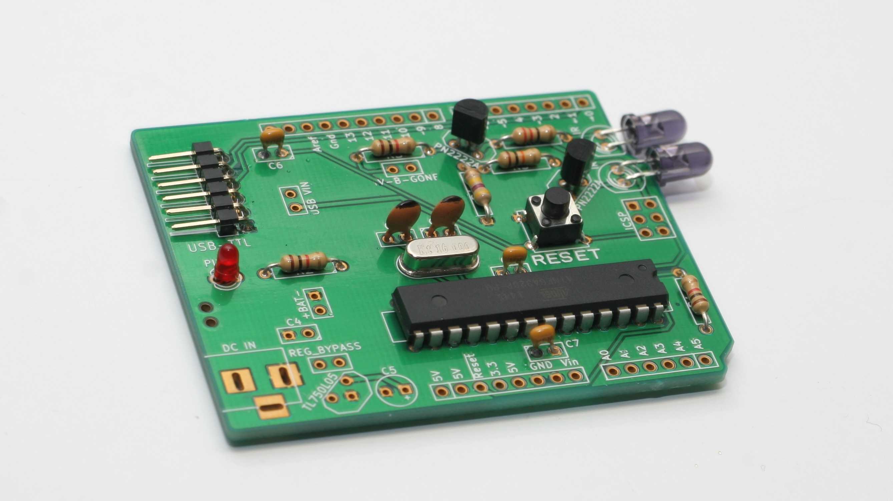

# uulmduino – Handbuch für Kursleiter_innen

Ein Free-Hardware+Software-Projekt nicht nur für Jugendliche.  

Basierend auf dem Diavolino von Evil Mad Scientist  
http://www.evilmadscientist.com/go/diavolino

Bausatzversion 2
Handbuch für Kursleiter_innen, passend zum Handbuch v. 0.21, 2015-11-25

# Vorbereitung

Cool, dass Du unser Projekt bei Dir umsetzen möchtest! :) Für die Umsetzung bei Dir brauchst Du die folgenden Dinge:

 * Platinen für alle Teilnehmer_innen, und am besten mindestens noch eine für Dich selbst zum vorher selbst ausprobieren. Falls Du die nicht selber mit den Design Files in diesem Repository herstellen willst, kannst Du auch welche von uns bekommen!
 * Für jedes Exemplar die notwendigen Bauteile, die [in der BOM aufgelistet sind](../BOM.md)
 * Ausreichend viele Lötarbeitsplätze (idealerweise pro Teilnehmer_in, ggf. auch ein Platz pro zwei Personen) mit
  * Lötkolben
  * Lötzinn
  * Entlötpumpe
  * Falls gewünscht: Flussmittel
  * Ausreichend Beleuchtung
  * ggf. Holzbrettchen als Lötunterlage
 * FTDI-232-Adapter zum Programmieren, samt USB-Kabel. Die gibt es in „Original“ für je 15 EUR bei Watterott, exp-tech und Co., oder als Clones für ca. 5 EUR von ebay – bei letzteren aber mit unklarer Funktionsgarantie. Im Idealfall hast Du ebensoviele FTDI-Adapter wie Teilnehmer\*innen.
 * Einen In-System-Programmer oder zwei klassische Arduinos, um die Atmegas vorher zu flashen
 * Ausreichend viele Rechner/Laptops mit der Arduino IDE, den Beispielprogrammen von Sparkfun und dem TV-B-Gone-Sketch
  * Falls Du Windows verwendest, musst du vorher den FTDI-Treiber installieren

## Atmegas flashen

*Bevor* die Bausätze verlötet werden, solltest du auf allen Microcontrollern den Arduino-Bootloader installieren. 

Wenn du ohnehin „klassische“ Arduinos herumliegen hast, kannst du einen davon als ISP verwenden, ihn per Drahtbrücken mit einem zweiten Arduino-Board verbinden und dort die „frischen“ Chips sockeln und flashen. Klingt kompliziert, geht aber recht simpel. [Eine Anleitung findest du hier](https://www.arduino.cc/en/Tutorial/ArduinoISP). Falls du keinen Arduino mit Wechselsockel hast, in den du die frischen Chips einsetzen kannst, geht das auch auf einem Steckbrett (siehe Anleitung).

Die andere (ggf. bei vielen zu flashenden Controllern etwas schnellere) Variante ist ein klassischer ISP. Der [usbasp](http://www.fischl.de/usbasp/) ist günstig zu haben, als China-Clon von ebay sogar für deutlich unter 5 EUR. In dem Fall würde ich dem Erfinder dann aber noch per PayPal ein paar Euro in den Hut werfen wollen ;)  
Mit dem usbasp lässt sich mittels 10-auf-6-Pin-Adapterkabel der Controller auch flashen, wenn er schon verlötet ist – dazu einfach die sechspolige Headerleiste auf der Platine bestücken, oder einen [Pogo-Pin-Adapter](http://www.exp-tech.de/isp-pogo-adapter) auf die Kontakte aufdrücken. Empfehlenswerter ist aber, die Controller vorher in ein passendes Evaluationsboard zu stecken und zu flashen – früher war das Pollin-Evaluationsboard für 15 EUR das Mittel der Wahl, heutzutage gibt es mit dem [aTeVaL](https://www.ehajo.de/aTeVaL-v2.0-Microchip-AVR-Evaluationsboard/200.018) für ca 30 EUR jedoch eine praktischere Lösung, bei der der USB-ISP-Adapter bereits integriert ist.

Auf [Sparkfun ist der Flash-Prozess mit einem USB-Adapter](https://learn.sparkfun.com/tutorials/installing-an-arduino-bootloader) ebenfalls gut beschrieben.
